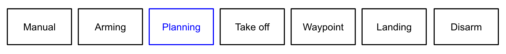
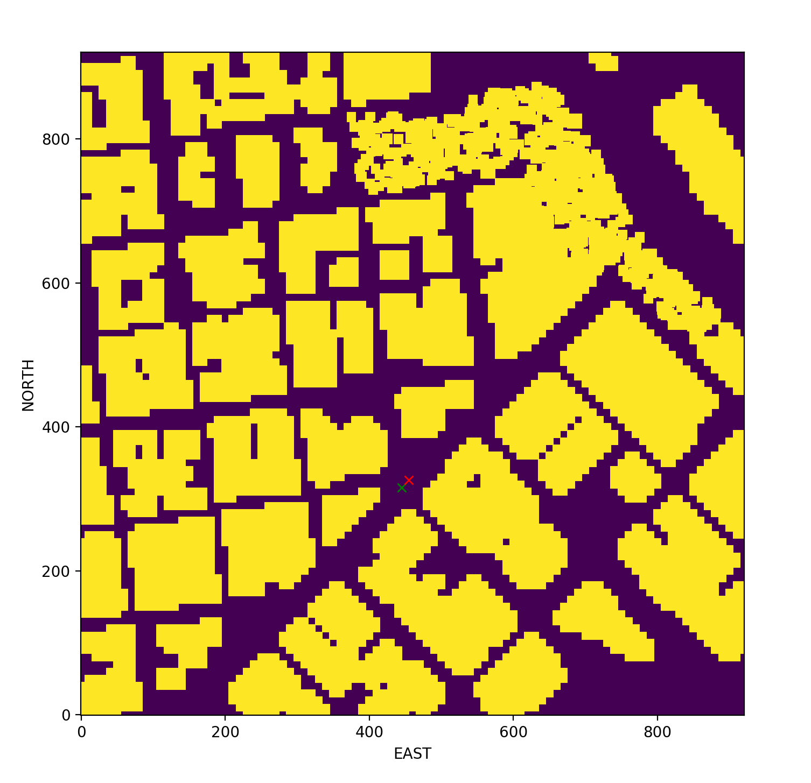

# FCND - 3D Motion Planing

## Writeup

<em>
Provide a Writeup / README that includes all the rubric points and how you addressed each one. You can submit your writeup as markdown or pdf.
</em>

- This MyReadme.md includes the rubric points and explain how I addressed each point.

## Explain the Starter Code

<em>
Test that motion_planning.py is a modified version of backyard_flyer_solution.py for simple path planning. Verify that both scripts work. Then, compare them side by side and describe in words how each of the modifications implemented in motion_planning.py is functioning.
</em>

- backyard_flyer_solution and motion_planning both are event driven, which event is LOCAL_POSITION, LOCAL_VELOCITY, STATE.

- In motion_planning, we have one more state PLANNING inbetween ARMING and TAKEOFF.
- The function 'plan_path' calculates waypoints from start to goal by a_star algorithm avoiding obstacles in colliders.csv.

- The map and start(green X) and goal(red X) are as bellow.

## Implementing Your Path Planning Algorithm

<em>
In the starter code, we assume that the home position is where the drone first initializes, but in reality you need to be able to start planning from anywhere. Modify your code to read the global home location from the first line of the colliders.csv file and set that position as global home (self.set_home_position())
</em>

~~~
        # TODO: read lat0, lon0 from colliders into floating point values
        print("Read colliders first line")
        infile = open('colliders.csv', 'r')
        firstLine = infile.readline()
        infile.close()
        temp = firstLine.strip().split(',')
        lat0 = float(temp[0].split()[1])
        lon0 = float(temp[1].split()[1])

        # TODO: set home position to (lon0, lat0, 0)
        print('set home position ({0}, {1}, 0)'.format(lon0, lat0))
        self.set_home_position(lon0, lat0, 0)
~~~

<em>
In the starter code, we assume the drone takes off from map center, but you'll need to be able to takeoff from anywhere. Retrieve your current position in geodetic coordinates from self._latitude, self._longitude and self._altitude. Then use the utility function global_to_local() to convert to local position (using self.global_home as well, which you just set)
</em>

- local_position means relative distance from global_home
~~~
        # TODO: retrieve current global position
        current_global_position = self.global_position

        # TODO: convert to current local position using global_to_local()
        local_position = global_to_local(self.global_position, self.global_home)
~~~

<em>
In the starter code, the start point for planning is hardcoded as map center. Change this to be your current local position.
</em>

- north_offset, east_offset are mininum of North, East from the function 'create_grid'.
- ( -north_offset, -east_offset ) means ( 0, 0 ) of colliders.csv, center of map.
- In order to set start current local location, we can use local_position above.
Since map center is ( -north_offset, -east_offset ), we need to shift it.

~~~
        # grid_start = (-north_offset, -east_offset)
        # TODO: convert start position to current position rather than map center
        grid_start = (int(np.ceil(local_position[0] - north_offset)) , int(np.ceil(local_position[1] - east_offset)))
~~~

- Now we can run motion_planning.py, the drone takes off where it landed instead of returning map center.

<em>
In the starter code, the goal position is hardcoded as some location 10 m north and 10 m east of map center. Modify this to be set as some arbitrary position on the grid given any geodetic coordinates (latitude, longitude)
</em>

-

<em>
Write your search algorithm. Minimum requirement here is to add diagonal motions to the A* implementation provided, and assign them a cost of sqrt(2). However, you're encouraged to get creative and try other methods from the lessons and beyond!
</em>

<em>
Cull waypoints from the path you determine using search.
</em>

## Executing the flight

<em>
This is simply a check on whether it all worked. Send the waypoints and the autopilot should fly you from start to goal!
</em>

